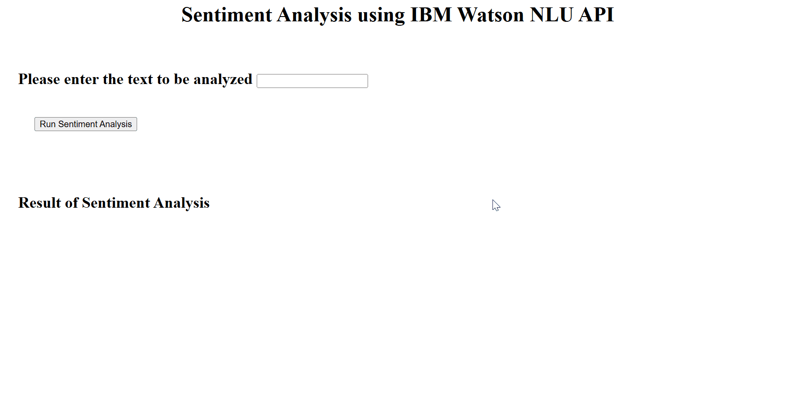

# sentiment-analysis

Sentiment analysis using IBM Watson NLU API. It can detect the sentiment of the text and the score. Web application deployed on the Flask server.

## Demo

- User can input the sentence and it will detect three sentiment of the text: positive, negative, and neutral
- It will also put the score of the text
- If the input is nonesense, it will displays 'Invalid text'
- If there is no input, it will displays 'Empty input'

## What I Learned
- Created an AI based sentiment analysis application using Watson NLU API.
- Formatted the output received from the Watson NLU API to extract relevant information from it.
- Packaged the application and made it importable to any python code for usage.
- Ran unit tests on the application and checked the validity of its outputs for different inputs.
- Deployed the application using Flask framework.
- Incorporated error handling capability in the application, such that a response code of 500 receives an appropriate response from the application.
- Ran static code analysis on the code files to confirm their adherence to the PEP8 guidelines.